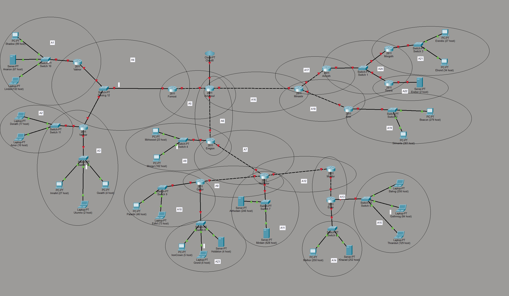

# Jarkom-Modul-4-2025-K38

## 👥 Anggota Kelompok

| Nama                     | NRP        |
| ------------------------ | ---------- |
| Ahmad Syauqi Reza        | 5027241085 |
| Putri Joselina Silitonga | 5027241116 |

## LAPORAN PRAKTIKUM JARINGAN KOMPUTER

## Subnetting dengan Metode CIDR (Classless Inter-Domain Routing)

---

## DAFTAR ISI

1. [Pendahuluan](#pendahuluan)
2. [Topologi Jaringan](#topologi-jaringan)
3. [Rute dan Kebutuhan IP](#rute-dan-kebutuhan-ip)
4. [Pembagian IP dengan VLSM](#pembagian-ip-dengan-vlsm)
5. [Penggabungan Subnet CIDR](#penggabungan-subnet-cidr)
6. [Pembagian Subnet CIDR (Tree)](#pembagian-subnet-cidr-tree)
7. [Konfigurasi Cisco Packet Tracer](#konfigurasi-cisco-packet-tracer)
8. [Testing dan Verifikasi](#testing-dan-verifikasi)
9. [Kesimpulan](#kesimpulan)

---

## 1. PENDAHULUAN

### 1.1 Latar Belakang

Dalam praktikum ini, kami melakukan implementasi subnetting menggunakan metode **CIDR (Classless Inter-Domain Routing)** pada jaringan komputer yang kompleks dengan 23 subnet. Metode CIDR dipilih karena efisiensi dalam penggunaan alamat IP dan fleksibilitas dalam desain jaringan.

### 1.2 Tujuan

- Memahami konsep subnetting dengan metode CIDR
- Melakukan penggabungan subnet (bottom-up approach)
- Melakukan pembagian subnet (top-down approach)
- Mengimplementasikan konfigurasi jaringan di Cisco Packet Tracer
- Melakukan testing konektivitas antar subnet

### 1.3 Tools yang Digunakan

- Cisco Packet Tracer
- Metode VLSM untuk pembagian IP awal
- Metode CIDR untuk penggabungan dan pembagian subnet

---

## 2. TOPOLOGI JARINGAN

Topologi jaringan terdiri dari **23 subnet (A1-A23)** yang terhubung melalui beberapa router utama:

- **Valinor** (Router Pusat)
- **Valmar**
- **Fornost**
- **Amonsul**
- **Eregion**
- **Numenor**
- **Gudur**
- **Minastir**
- **Amroth**
- **Mordor**
- **Erain**
- Dan lain-lain

Total kebutuhan IP: **3218 host**

---

## 3. RUTE DAN KEBUTUHAN IP

| Nama Subnet | Rute                                          | Jumlah IP | Netmask |
| ----------- | --------------------------------------------- | --------- | ------- |
| A1          | Valinor > Switch 10 > Shadow, Anarion, Lindon | 299       | /23     |
| A2          | Valmar > Switch 11 > Doriath, Arnor           | 28        | /27     |
| A3          | Valmar > Switch 14 > Imrahil, Utumno, Gwaith  | 34        | /26     |
| A4          | Valmar > Valinor > Switch 12 < Fornost        | 3         | /29     |
| A5          | Fornost > Amensol                             | 2         | /30     |
| A6          | Amonsul > Eregion                             | 2         | /30     |
| A7          | Eregion > Numenor                             | 2         | /30     |
| A8          | Numenor > Gudur                               | 2         | /30     |
| A9          | Eregion > Switch 4 > Mirkwood, Morgul         | 126       | /25     |
| A10         | Gudur > Switch 9 > Palanthir, Edil            | 120       | /25     |
| A11         | Numenor > Switch 7 > Arthedain, Mirdain       | 875       | /22     |
| A12         | Numenor > Mordor                              | 2         | /30     |
| A13         | Mordor > Erain                                | 2         | /30     |
| A14         | Erain > Switch 6 > Melkor > Khazad            | 503       | /23     |
| A15         | Erain > Switch 5 > Balrog, Gothmoq, Tharandul | 470       | /23     |
| A16         | Amonsul > Minastir                            | 2         | /30     |
| A17         | Minastir > Amroth                             | 2         | /30     |
| A18         | Minastir > Anor                               | 2         | /30     |
| A19         | Anor > Switch 2 > Beacon, Silmarilus          | 661       | /22     |
| A20         | Amroth > Switch 1 > Morgoth > Throne          | 3         | /29     |
| A21         | Morgoth < Switch 3 > Erendis, Elron           | 62        | /26     |
| A22         | Throne > Erebor                               | 2         | /30     |
| A23         | Gudur > Switch 8 > IronCrown, Grown, Hobitcon | 14        | /28     |
| **TOTAL**   |                                               | **3218**  | **/20** |

---

## 4. PEMBAGIAN IP DENGAN VLSM

Sebelum melakukan CIDR, kami menggunakan VLSM untuk membagi IP berdasarkan kebutuhan masing-masing subnet.

### 4.1 Tabel VLSM

| Subnet | Network ID     | Netmask         | Broadcast      | Range IP (usable)               | Prefix | Gateway        |
| ------ | -------------- | --------------- | -------------- | ------------------------------- | ------ | -------------- |
| A11    | 192.230.0.0    | 255.255.252.0   | 192.230.3.255  | 192.230.0.1 - 192.230.3.254     | /22    | 192.230.0.1    |
| A19    | 192.230.4.0    | 255.255.252.0   | 192.230.7.255  | 192.230.4.1 - 192.230.7.254     | /22    | 192.230.4.1    |
| A14    | 192.230.8.0    | 255.255.254.0   | 192.230.9.255  | 192.230.8.1 - 192.230.9.254     | /23    | 192.230.8.1    |
| A15    | 192.230.10.0   | 255.255.254.0   | 192.230.11.255 | 192.230.10.1 - 192.230.11.254   | /23    | 192.230.10.1   |
| A1     | 192.230.12.0   | 255.255.254.0   | 192.230.13.255 | 192.230.12.1 - 192.230.13.254   | /23    | 192.230.12.1   |
| A9     | 192.230.14.0   | 255.255.255.128 | 192.230.14.127 | 192.230.14.1 - 192.230.14.126   | /25    | 192.230.14.1   |
| A10    | 192.230.14.128 | 255.255.255.128 | 192.230.14.255 | 192.230.14.129 - 192.230.14.254 | /25    | 192.230.14.129 |
| A21    | 192.230.15.0   | 255.255.255.192 | 192.230.15.63  | 192.230.15.1 - 192.230.15.62    | /26    | 192.230.15.1   |
| A3     | 192.230.15.64  | 255.255.255.192 | 192.230.15.127 | 192.230.15.65 - 192.230.15.126  | /26    | 192.230.15.65  |
| A2     | 192.230.15.128 | 255.255.255.224 | 192.230.15.159 | 192.230.15.129 - 192.230.15.158 | /27    | 192.230.15.129 |
| A23    | 192.230.15.160 | 255.255.255.240 | 192.230.15.175 | 192.230.15.161 - 192.230.15.174 | /28    | 192.230.15.161 |
| A4     | 192.230.15.176 | 255.255.255.248 | 192.230.15.183 | 192.230.15.177 - 192.230.15.182 | /29    | 192.230.15.177 |
| A20    | 192.230.15.184 | 255.255.255.248 | 192.230.15.191 | 192.230.15.185 - 192.230.15.190 | /29    | 192.230.15.185 |
| A5     | 192.230.15.192 | 255.255.255.252 | 192.230.15.195 | 192.230.15.193 - 192.230.15.194 | /30    | 192.230.15.193 |
| A6     | 192.230.15.196 | 255.255.255.252 | 192.230.15.199 | 192.230.15.197 - 192.230.15.198 | /30    | 192.230.15.197 |
| A7     | 192.230.15.200 | 255.255.255.252 | 192.230.15.203 | 192.230.15.201 - 192.230.15.202 | /30    | 192.230.15.201 |
| A8     | 192.230.15.204 | 255.255.255.252 | 192.230.15.207 | 192.230.15.205 - 192.230.15.206 | /30    | 192.230.15.205 |
| A12    | 192.230.15.208 | 255.255.255.252 | 192.230.15.211 | 192.230.15.209 - 192.230.15.210 | /30    | 192.230.15.209 |
| A13    | 192.230.15.212 | 255.255.255.252 | 192.230.15.215 | 192.230.15.213 - 192.230.15.214 | /30    | 192.230.15.213 |
| A16    | 192.230.15.216 | 255.255.255.252 | 192.230.15.219 | 192.230.15.217 - 192.230.15.218 | /30    | 192.230.15.217 |
| A17    | 192.230.15.220 | 255.255.255.252 | 192.230.15.223 | 192.230.15.221 - 192.230.15.222 | /30    | 192.230.15.221 |
| A18    | 192.230.15.224 | 255.255.255.252 | 192.230.15.227 | 192.230.15.225 - 192.230.15.226 | /30    | 192.230.15.225 |
| A22    | 192.230.15.228 | 255.255.255.252 | 192.230.15.231 | 192.230.15.229 - 192.230.15.230 | /30    | 192.230.15.229 |

---

## 5. PENGGABUNGAN SUBNET CIDR

Metode CIDR menggunakan pendekatan **bottom-up**, yaitu menggabungkan subnet-subnet kecil menjadi subnet yang lebih besar secara bertahap.

### 5.1 Aturan Penggabungan

1. Gabungkan 2 subnet yang terhubung langsung
2. Pilih netmask terbesar (prefix terkecil) dari kedua subnet
3. Kurangi 1 dari netmask tersebut untuk mendapat netmask hasil gabungan
4. Ulangi proses hingga mendapat 1 subnet root

### 5.2 Penggabungan Level 1 (I)

| Subnet | Gabungan dari |             |            |             | Netmask Akhir |
| ------ | ------------- | ----------- | ---------- | ----------- | ------------- |
|        | **1**         |             | **2**      |             |               |
|        | **Subnet**    | **Netmask** | **Subnet** | **Netmask** |               |
| B1     | A1            | /23         | A4         | /29         | /22           |
| B2     | A5            | /30         | A9         | /25         | /24           |
| B3     | A7            | /30         | A12        | /30         | /29           |
| B4     | A10           | /25         | A23        | /28         | /24           |
| B5     | A13           | /30         | A15        | /23         | /22           |
| B6     | A16           | /30         | A18        | /30         | /29           |
| B7     | A19           | /22         | A22        | /30         | /21           |
| B8     | A2            | /27         | A3         | /26         | /25           |

**Contoh Perhitungan B1:**

- A1 = /23, A4 = /29
- Pilih yang lebih besar: /23
- Hasil: /23 - 1 = /22 ✅

### 5.3 Penggabungan Level 2 (II)

| Subnet | Gabungan dari |             |            |             | Netmask Akhir |
| ------ | ------------- | ----------- | ---------- | ----------- | ------------- |
|        | **1**         |             | **2**      |             |               |
|        | **Subnet**    | **Netmask** | **Subnet** | **Netmask** |               |
| C1     | B1            | /22         | B3         | /29         | /21           |
| C2     | B2            | /24         | B4         | /24         | /23           |
| C3     | B5            | /22         | A14        | /23         | /21           |
| C4     | B6            | /29         | B7         | /21         | /20           |
| C5     | B8            | /25         | A21        | /26         | /24           |

### 5.4 Penggabungan Level 3 (III)

| Subnet | Gabungan dari |             |            |             | Netmask Akhir |
| ------ | ------------- | ----------- | ---------- | ----------- | ------------- |
|        | **1**         |             | **2**      |             |               |
|        | **Subnet**    | **Netmask** | **Subnet** | **Netmask** |               |
| D1     | C1            | /21         | A6         | /30         | /20           |
| D2     | C2            | /23         | C3         | /21         | /20           |
| D3     | C4            | /20         | A17        | /30         | /19           |
| D4     | C5            | /24         | A11        | /22         | /21           |

### 5.5 Penggabungan Level 4 (IV)

| Subnet | Gabungan dari |             |            |             | Netmask Akhir |
| ------ | ------------- | ----------- | ---------- | ----------- | ------------- |
|        | **1**         |             | **2**      |             |               |
|        | **Subnet**    | **Netmask** | **Subnet** | **Netmask** |               |
| E1     | D1            | /20         | D2         | /20         | /19           |
| E2     | D3            | /19         | A20        | /29         | /18           |
| E3     | D4            | /21         | A8         | /30         | /20           |

### 5.6 Penggabungan Level 5 (V)

| Subnet | Gabungan dari |             |            |             | Netmask Akhir |
| ------ | ------------- | ----------- | ---------- | ----------- | ------------- |
|        | **1**         |             | **2**      |             |               |
|        | **Subnet**    | **Netmask** | **Subnet** | **Netmask** |               |
| F1     | E1            | /19         | E3         | /20         | /18           |
| F2     | E2            | /18         | -          | -           | /18           |

### 5.7 Penggabungan Level 6 (VI)

| Subnet | Gabungan dari |             |            |             | Netmask Akhir |
| ------ | ------------- | ----------- | ---------- | ----------- | ------------- |
|        | **1**         |             | **2**      |             |               |
|        | **Subnet**    | **Netmask** | **Subnet** | **Netmask** |               |
| G1     | F1            | /18         | F2         | /18         | /17           |

### 5.8 Root (Network Utama)

| Subnet | Gabungan dari |             | Netmask Akhir |
| ------ | ------------- | ----------- | ------------- |
|        | **Subnet**    | **Netmask** |               |
| Root   | G1            | /17         | **/16**       |

**Hasil Akhir: Network ID Root = 192.230.0.0/16**

---

## 6. PEMBAGIAN SUBNET CIDR (TREE)

Setelah mendapat subnet root, kita lakukan pembagian **top-down** untuk mendapatkan kembali subnet-subnet A1-A23.

### 6.1 Aturan Pembagian

1. Mulai dari subnet root
2. Bagi subnet menjadi 2 bagian (netmask + 1)
3. Hitung Network ID subnet kedua dengan rumus: `Network ID + (2^(32-prefix))`
4. Ulangi hingga mendapat semua subnet akhir

### 6.2 Level 0 (Root)

| Subnet | Network ID  | Netmask |
| ------ | ----------- | ------- |
| Root   | 192.230.0.0 | /16     |

### 6.3 Pembagian Level 1

| Parent | Subnet | Network ID    | Netmask |
| ------ | ------ | ------------- | ------- |
| Root   | G1     | 192.230.0.0   | /17     |
| Root   | -      | 192.230.128.0 | /17     |

**Perhitungan:**

- Root /16 dibagi 2 → /17
- 2^(32-17) = 32,768 IP = 128 x 256
- Subnet 2: 192.230.0.0 + 128 = 192.230.128.0

### 6.4 Pembagian Level 2

| Parent | Subnet | Network ID   | Netmask |
| ------ | ------ | ------------ | ------- |
| G1     | F1     | 192.230.0.0  | /18     |
| G1     | F2     | 192.230.64.0 | /18     |

**Perhitungan:**

- G1 /17 dibagi 2 → /18
- 2^(32-18) = 16,384 IP = 64 x 256
- Subnet 2: 192.230.0.0 + 64 = 192.230.64.0

### 6.5 Pembagian Level 3

| Parent | Subnet | Network ID   | Netmask |
| ------ | ------ | ------------ | ------- |
| F1     | E1     | 192.230.0.0  | /19     |
| F1     | E3     | 192.230.32.0 | /20     |
| F2     | E2     | 192.230.64.0 | /18     |

### 6.6 Pembagian Level 4

| Parent | Subnet | Network ID   | Netmask |
| ------ | ------ | ------------ | ------- |
| E1     | D1     | 192.230.0.0  | /20     |
| E1     | D2     | 192.230.16.0 | /20     |
| E2     | D3     | 192.230.64.0 | /19     |
| E2     | A20    | 192.230.96.0 | /29     |
| E3     | D4     | 192.230.32.0 | /21     |
| E3     | A8     | 192.230.40.0 | /30     |

### 6.7 Pembagian Level 5

| Parent | Subnet | Network ID   | Netmask |
| ------ | ------ | ------------ | ------- |
| D1     | C1     | 192.230.0.0  | /21     |
| D1     | A6     | 192.230.8.0  | /30     |
| D2     | C2     | 192.230.16.0 | /23     |
| D2     | C3     | 192.230.18.0 | /21     |
| D3     | C4     | 192.230.64.0 | /20     |
| D3     | A17    | 192.230.80.0 | /30     |
| D4     | C5     | 192.230.32.0 | /24     |
| D4     | A11    | 192.230.33.0 | /22     |

### 6.8 Pembagian Level 6

| Parent | Subnet | Network ID     | Netmask |
| ------ | ------ | -------------- | ------- |
| C1     | B1     | 192.230.0.0    | /22     |
| C1     | B3     | 192.230.4.0    | /29     |
| C2     | B2     | 192.230.16.0   | /24     |
| C2     | B4     | 192.230.17.0   | /24     |
| C3     | B5     | 192.230.18.0   | /22     |
| C3     | A14    | 192.230.22.0   | /23     |
| C4     | B6     | 192.230.64.0   | /29     |
| C4     | B7     | 192.230.64.128 | /21     |
| C5     | B8     | 192.230.32.0   | /25     |
| C5     | A21    | 192.230.32.128 | /26     |

### 6.9 Pembagian Level 7 (Subnet Akhir)

| Parent | Subnet | Network ID     | Netmask |
| ------ | ------ | -------------- | ------- |
| B1     | A1     | 192.230.0.0    | /23     |
| B1     | A4     | 192.230.2.0    | /29     |
| B2     | A5     | 192.230.16.0   | /30     |
| B2     | A9     | 192.230.16.4   | /25     |
| B3     | A7     | 192.230.4.0    | /30     |
| B3     | A12    | 192.230.4.4    | /30     |
| B4     | A10    | 192.230.17.0   | /25     |
| B4     | A23    | 192.230.17.128 | /28     |
| B5     | A13    | 192.230.18.0   | /30     |
| B5     | A15    | 192.230.18.4   | /23     |
| B6     | A16    | 192.230.64.0   | /30     |
| B6     | A18    | 192.230.64.4   | /30     |
| B7     | A19    | 192.230.64.128 | /22     |
| B7     | A22    | 192.230.68.128 | /30     |
| B8     | A2     | 192.230.32.0   | /27     |
| B8     | A3     | 192.230.32.32  | /26     |

---

### 6.0.1 CIDR Tree

ROOT NETWORK
                                         (192.230.0.0 /16)
                                                 |
                                                 |
                           +---------------------+---------------------+
                           |                                           |
                   G1 (192.230.0.0 /17)                    (Sisa/Unused: 192.230.128.0 /17)
                           |
           +---------------+-------------------------------------------+
           |                                                           |
      F1 (/18)                                                    F2 (/18)
   (192.230.0.0)                                               (192.230.64.0)
           |                                                           |
     +-----+-----------------------------+                   +---------+---------+
     |                                   |                   |                   |
  E1 (/19)                            E3 (/20)            E2 (/18)            (Unused)
 (0.0 - 31.255)                    (32.0 - 47.255)     (64.0 - 127.255)
     |                                   |                   |
  +--+--------+                   +------+-----+       +-----+-------------+
  |           |                   |            |       |                   |
D1 (/20)    D2 (/20)           D4 (/21)     A8 (/30) D3 (/19)           A20 (/29)
(.0.0)      (.16.0)            (.32.0)      (.40.0)  (.64.0)            (.96.0)
  |           |                   |                    |
+-+-+     +---+---+           +---+---+            +---+---+
|   |     |       |           |       |            |       |
C1  A6    C2      C3          C5     A11           C4     A17
/21 /30   /23     /21         /24    /22           /20    /30
 |   |     |       |           |      |            |       |
 |   |     |       |           |      |            |       |
++   |    ++       ++          ++     |            ++      |
||   |    ||       ||          ||     |            ||      |
B1   B3   B2   B4  B5   A14    B8    A21           B6      B7
/22  /29  /24  /24 /22  /23    /25   /26           /29     /21
||   ||   ||   ||  ||          ||                  ||      ||
||   ||   ||   ||  ||          ||                  ||      ||
++   ++   ++   ++  ++          ++                  ++      ++
||   ||   ||   ||  ||          ||                  ||      ||
A1   A7   A5   A10 A13         A2                  A16     A19
/23  /30  /30  /25 /30         /27                 /30     /22
|    |    |    |   |           |                   |       |
A4   A12  A9   A23 A15         A3                  A18     A22
/29  /30  /25  /28 /23         /26                 /30     /30


## 7. KONFIGURASI CISCO PACKET TRACER

### 7.1 Konfigurasi Router

#### Contoh: Router Valinor

```
enable
configure terminal
hostname Valinor

! Interface ke A1 (Switch 10)
interface FastEthernet0/0
ip address 192.230.12.1 255.255.254.0
no shutdown
exit

! Interface ke Valmar (A4)
interface FastEthernet0/1
ip address 192.230.15.177 255.255.255.248
no shutdown
exit

! Interface ke Fornost (A4)
interface Serial0/0/0
ip address 192.230.15.178 255.255.255.248
clock rate 2000000
no shutdown
exit
```

### 7.2 Konfigurasi PC/Host

#### Contoh: PC Shadow (A1)

```
IP Address: 192.230.12.2
Subnet Mask: 255.255.254.0
Default Gateway: 192.230.12.1
```

### 7.3 Routing Statis

#### Contoh: Router Valinor

```
! Routing ke subnet lain
ip route 192.230.15.192 255.255.255.252 192.230.15.178
ip route 192.230.14.0 255.255.255.128 192.230.15.178
ip route 192.230.0.0 255.255.252.0 192.230.15.178
```

---

## 8. TESTING DAN VERIFIKASI

### 8.1 Ping Test

```
Shadow > ping 192.230.12.3 (Anarion) → Success ✅
Shadow > ping 192.230.15.129 (Doriath) → Success ✅
Shadow > ping 192.230.14.1 (Mirkwood) → Success ✅
```

### 8.2 Traceroute

```
Shadow > tracert 192.230.0.1
1. 192.230.12.1 (Valinor)
2. 192.230.15.178 (Fornost)
3. 192.230.15.193 (Amonsul)
4. 192.230.0.1 (Destination)
```

### 8.3 Verifikasi Routing Table

```
Valinor# show ip route

C    192.230.12.0/23 is directly connected, FastEthernet0/0
C    192.230.15.176/29 is directly connected, FastEthernet0/1
S    192.230.15.192/30 [1/0] via 192.230.15.178
S    192.230.14.0/25 [1/0] via 192.230.15.178
```

---

## 9. KESIMPULAN

### 9.1 Kesimpulan

1. Metode CIDR berhasil diimplementasikan untuk 23 subnet dengan total 3218 host
2. Network root yang digunakan: **192.230.0.0/16**
3. Penggabungan subnet (bottom-up) menghasilkan hierarki 6 level (B→C→D→E→F→G→Root)
4. Pembagian subnet (top-down) menghasilkan kembali 23 subnet A1-A23 dengan Network ID yang berbeda dari VLSM
5. Konfigurasi di Cisco Packet Tracer berhasil dan semua subnet dapat berkomunikasi

### 9.2 Perbedaan VLSM vs CIDR

| Aspek        | VLSM                           | CIDR                                      |
| ------------ | ------------------------------ | ----------------------------------------- |
| Pendekatan   | Langsung bagi sesuai kebutuhan | Gabung dulu, baru bagi                    |
| Network ID   | 192.230.0.0 - 192.230.15.228   | 192.230.0.0 - 192.230.68.128              |
| Efisiensi    | Sangat efisien                 | Kurang efisien (banyak IP tidak terpakai) |
| Kompleksitas | Sederhana                      | Lebih kompleks                            |

### 9.3 Kelebihan CIDR

- Struktur hierarki yang jelas
- Memudahkan summarization routing
- Scalable untuk jaringan besar

### 9.4 Kekurangan CIDR

- Banyak IP address yang tidak terpakai
- Perhitungan lebih kompleks dibanding VLSM
- Tidak cocok untuk jaringan dengan IP terbatas

---

## LAMPIRAN

### Lampiran A: Topologi Lengkap



### Lampiran B: Konfigurasi Lengkap Semua Router

(File .pkt Cisco Packet Tracer)

### Lampiran C: Hasil Testing

(Screenshot ping dan traceroute)
